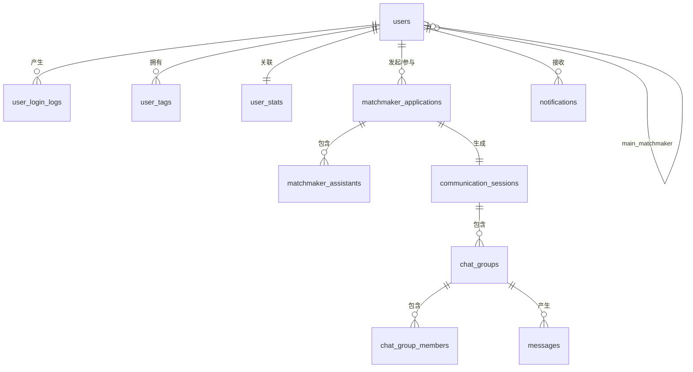
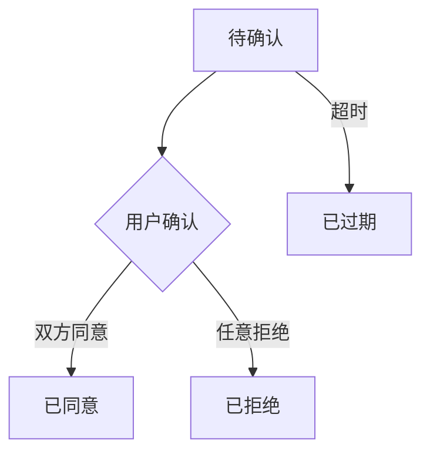
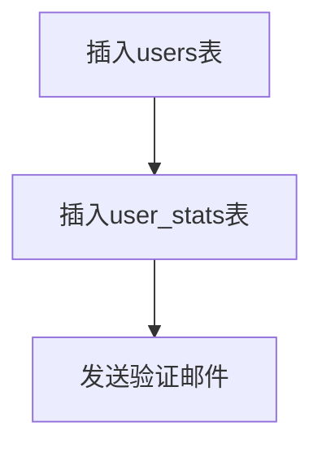
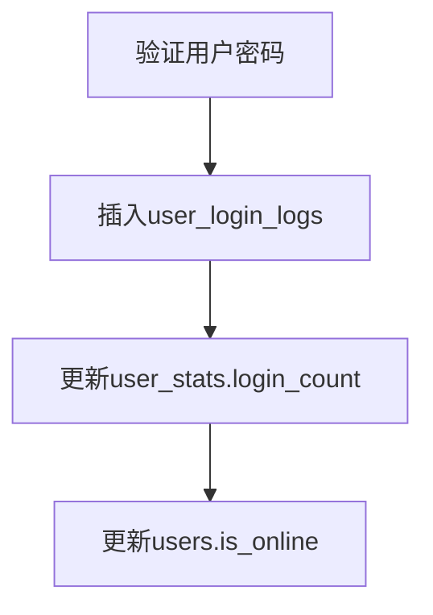
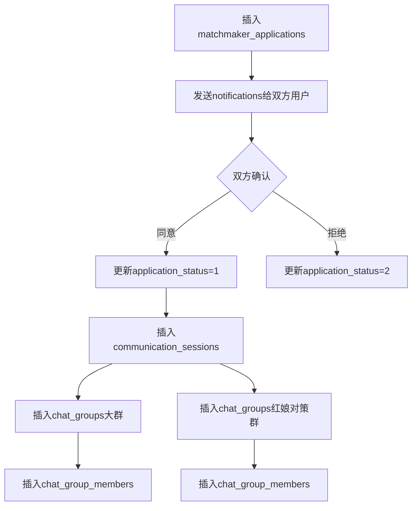
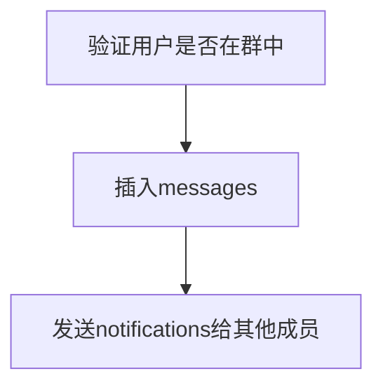

# SQL 数据库设计说明文档

## 概述

本文档为婚恋社交平台的数据库设计说明，包含11张核心数据表，覆盖用户管理和沟通管理两大业务模块。数据库采用 MySQL InnoDB 引擎，字符集为 utf8mb4，支持完整的 Unicode 字符。

## 数据库架构

### 整体架构图

### 模块划分

| 模块 | 表名 | 说明 |
| :--- | :--- | :--- |
| **用户管理** | `users` | 用户主表，存储账号基础信息 |
| | `user_login_logs` | 登录日志，记录登录行为 |
| | `user_tags` | 用户标签，支持官方和自定义标签 |
| | `user_stats` | 用户统计信息，存储登录次数、人气值等 |
| **沟通管理** | `matchmaker_applications` | 牵线申请表，红娘发起的配对申请 |
| | `matchmaker_assistants` | 辅助红娘关联表，主红娘选择的辅助人员 |
| | `communication_sessions` | 沟通会话表，牵线成功后的正式会话 |
| | `chat_groups` | 群组表，大群和红娘对策群 |
| | `chat_group_members` | 群成员表，记录群成员信息 |
| | `messages` | 消息记录表，存储聊天消息 |
| | `notifications` | 通知表，存储系统通知 |

## 表详细说明

### 1. 用户主表 (users)

**核心功能**：存储用户账号基础信息，是整个系统的核心表。

**关键字段说明**：

| 字段 | 说明 | 设计考虑 |
| :--- | :--- | :--- |
| `role` | 角色标识 | 0-普通用户，1-红娘用户，使用TINYINT节省空间 |
| `gender` | 性别 | 0-保密，1-男，2-女，支持三种常见选项 |
| `status` | 用户状态 | 0-禁用，1-正常，用于账号管理 |
| `is_online` | 在线状态 | 0-离线，1-在线，用于前端展示 |
| `current_partner_id` | 当前交往对象 | 自引用外键，支持一对一关系 |
| `main_matchmaker_id` | 牵线红娘 | 自引用外键，记录牵线成功的红娘 |
| `deleted_at` | 软删除时间 | 支持逻辑删除，保留历史数据 |

**索引设计**：
- `idx_username`：唯一索引，确保用户名唯一
- `idx_email`：唯一索引，确保邮箱唯一
- `idx_role`：普通索引，用于角色筛选
- `idx_status`：普通索引，用于状态筛选
- `idx_current_partner_id`：普通索引，用于查询交往关系
- `idx_main_matchmaker_id`：普通索引，用于查询红娘关联

### 2. 用户登录日志表 (user_login_logs)

**核心功能**：记录用户登录行为，用于安全审计和用户行为分析。

**关键字段说明**：

| 字段 | 说明 | 设计考虑 |
| :--- | :--- | :--- |
| `login_ip` | 登录IP | 用于安全审计，追踪异常登录 |
| `device_type` | 设备类型 | 区分web/ios/android等平台 |
| `device_info` | 设备详细信息 | 存储UA等设备标识 |

### 3. 用户标签表 (user_tags)

**核心功能**：存储用户标签，支持官方标签和自定义标签。

**关键字段说明**：

| 字段 | 说明 | 设计考虑 |
| :--- | :--- | :--- |
| `tag_type` | 标签类型 | 0-官方标签，1-自定义标签，便于区分和管理 |

**唯一约束**：`(user_id, tag_name)` 确保同一用户不会重复添加相同标签。

### 4. 用户统计信息表 (user_stats)

**核心功能**：存储用户统计数据，与主表分离以减少主表更新频率。

**关键字段说明**：

| 字段 | 说明 | 设计考虑 |
| :--- | :--- | :--- |
| `login_count` | 登录次数 | 累计统计，登录时递增 |
| `interaction_count` | 互动次数 | 点赞、评论等行为统计 |
| `popularity_score` | 人气值 | 用户受欢迎程度指标 |

### 5. 红娘牵线申请表 (matchmaker_applications)

**核心功能**：记录红娘发起的牵线申请，是沟通流程的起点。

**关键字段说明**：

| 字段 | 说明 | 设计考虑 |
| :--- | :--- | :--- |
| `user_a_status` | 用户A确认状态 | 0-待确认，1-同意，2-拒绝 |
| `user_b_status` | 用户B确认状态 | 0-待确认，1-同意，2-拒绝 |
| `application_status` | 申请状态 | 综合状态，便于查询 |
| `expire_time` | 过期时间 | 支持申请超时自动失效 |

**状态流转**：

### 6. 辅助红娘关联表 (matchmaker_assistants)

**核心功能**：记录主红娘选择的辅助红娘，支持一对多关系。

**唯一约束**：`(application_id, assistant_id)` 确保同一辅助红娘不会重复添加到同一申请。

### 7. 沟通会话表 (communication_sessions)

**核心功能**：牵线申请成功后创建的正式沟通会话。

**关键字段说明**：

| 字段 | 说明 | 设计考虑 |
| :--- | :--- | :--- |
| `application_id` | 关联申请ID | 唯一约束，确保一个申请对应一个会话 |
| `session_status` | 会话状态 | 0-已结束，1-进行中 |

### 8. 群组表 (chat_groups)

**核心功能**：存储沟通群组信息，支持两种群组类型。

**关键字段说明**：

| 字段 | 说明 | 设计考虑 |
| :--- | :--- | :--- |
| `group_type` | 群组类型 | 0-大群（红娘+双方用户），1-红娘对策群 |
| `group_status` | 群组状态 | 0-已解散，1-正常 |

**群组类型说明**：
- **大群**：包含主红娘、辅助红娘、用户A、用户B，用于正式沟通
- **红娘对策群**：包含主红娘和辅助红娘，用于讨论牵线策略

### 9. 群成员表 (chat_group_members)

**核心功能**：记录群成员信息，支持成员角色管理。

**关键字段说明**：

| 字段 | 说明 | 设计考虑 |
| :--- | :--- | :--- |
| `member_role` | 成员角色 | 0-普通成员，1-群主，2-管理员 |
| `is_active` | 是否活跃 | 0-已离开，1-活跃，支持软删除 |

**唯一约束**：`(group_id, user_id)` 确保同一用户不会重复加入同一群组。

### 10. 消息记录表 (messages)

**核心功能**：存储聊天消息，支持多种消息类型。

**关键字段说明**：

| 字段 | 说明 | 设计考虑 |
| :--- | :--- | :--- |
| `message_type` | 消息类型 | 0-文本，1-图片，2-语音，3-视频，4-文件 |
| `file_url` | 文件URL | 图片/视频/文件消息使用 |
| `duration` | 时长 | 语音/视频消息使用 |
| `is_read` | 是否已读 | 0-未读，1-已读 |

### 11. 通知表 (notifications)

**核心功能**：存储系统通知，支持多种通知类型。

**关键字段说明**：

| 字段 | 说明 | 设计考虑 |
| :--- | :--- | :--- |
| `notification_type` | 通知类型 | 0-牵线邀请，1-牵线同意，2-牵线拒绝，3-消息提醒，4-系统通知 |
| `related_id` | 关联业务ID | 关联申请ID或消息ID，便于跳转到详情 |
| `is_read` | 是否已读 | 0-未读，1-已读 |

## 核心业务流程

### 1. 用户注册流程

### 2. 用户登录流程

### 3. 牵线申请流程

### 4. 消息发送流程

## 关键设计决策

### 1. 软删除设计

- 用户表和群成员表使用 `deleted_at` 和 `is_active` 字段实现软删除
- 优点：保留历史数据，支持数据恢复，便于审计
- 缺点：查询时需额外过滤条件

### 2. 状态字段设计

- 使用 TINYINT 存储状态，节省空间且便于索引
- 定义明确的状态常量，避免魔法数字
- 状态流转需在业务层严格控制

### 3. 外键约束

- 所有关联表都建立外键约束，保证数据完整性
- 删除操作需注意级联关系，建议使用软删除

### 4. 索引设计原则

- 唯一索引：用于唯一标识字段（如username、email）
- 普通索引：用于高频查询字段（如user_id、status、group_id）
- 复合索引：用于联合查询（如user_id+tag_name、group_id+user_id）

### 5. 表分离设计

- 用户基础信息和统计信息分离，减少主表更新频率
- 登录日志独立存储，避免影响主表性能
- 消息表独立存储，支持海量消息存储

## 性能优化建议

1. **消息表分区**：按 `send_time` 分区，支持历史数据归档
2. **缓存策略**：用户在线状态、会话列表等高频访问数据使用Redis缓存
3. **读写分离**：数据库主从复制，读操作从从库执行
4. **索引优化**：根据实际查询场景调整索引，避免冗余索引
5. **批量操作**：消息发送等场景使用批量插入，减少数据库连接开销

## 安全性考虑

1. **密码加密**：使用 bcrypt 或 Argon2 加密存储，禁止明文
2. **SQL注入防护**：使用参数化查询或ORM框架
3. **敏感信息脱敏**：日志和API响应中敏感字段脱敏处理
4. **访问控制**：根据角色和权限控制数据访问
5. **数据备份**：定期备份数据库，支持灾难恢复

## 部署建议

1. **字符集**：统一使用 utf8mb4，支持完整Unicode字符
2. **引擎**：使用 InnoDB 引擎，支持事务和外键约束
3. **连接池**：配置合理的数据库连接池大小
4. **监控**：部署数据库监控，及时发现性能问题
5. **备份**：配置定期自动备份，确保数据安全