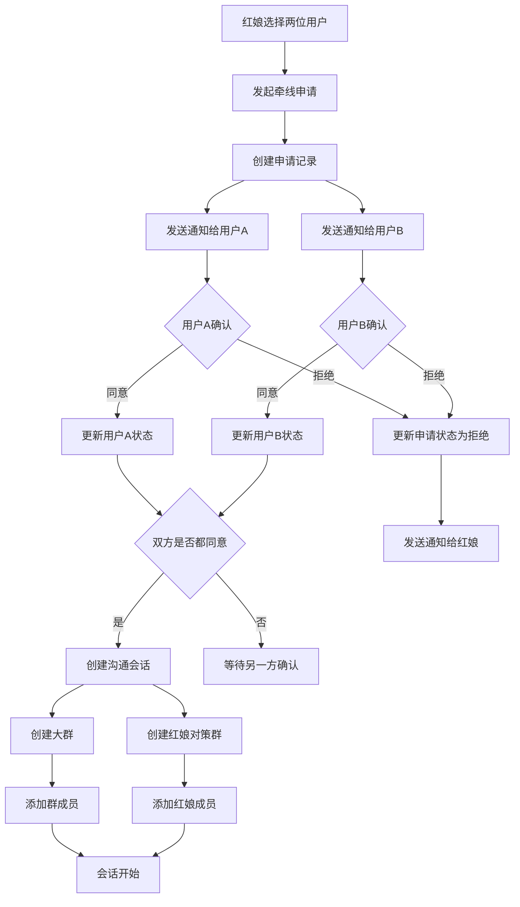
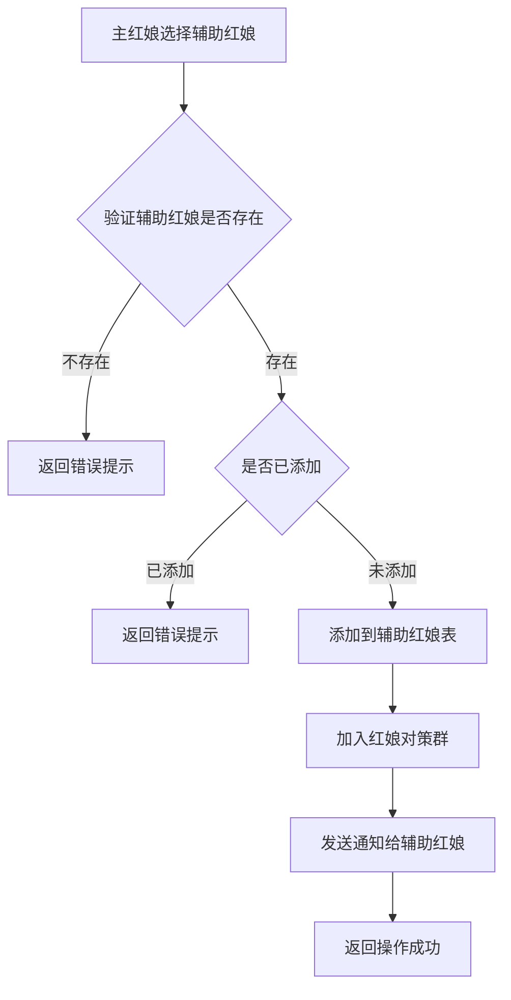
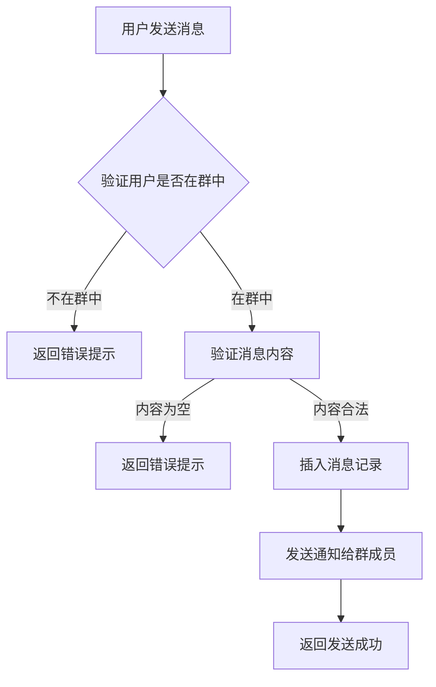
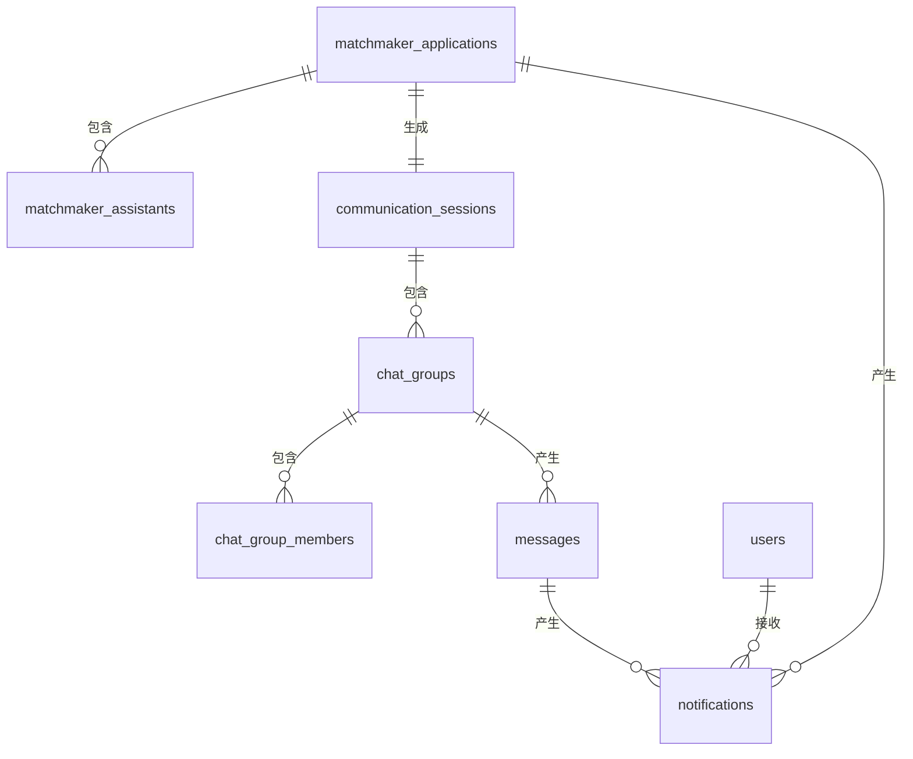

# 沟通管理

## 业务概述

本系统为婚恋社交平台的沟通管理模块，负责红娘牵线、用户沟通、群组聊天等核心业务功能。核心流程为：红娘发起牵线申请 → 用户确认同意 → 建立沟通会话 → 创建群组 → 开始沟通交流。

## 角色定义

### 普通用户
- 接受红娘牵线，与其他普通用户建立沟通关系
- 可以接受或拒绝牵线申请
- 参与群组沟通

### 红娘用户
- 发起牵线申请，为普通用户配对
- 需要竞争上岗，获得双方用户同意后正式担任牵线红娘
- 可以选择辅助红娘协助工作
- 参与群组沟通和策略讨论

## 功能模块

1. **牵线申请**：红娘选择用户发起牵线申请
2. **申请确认**：用户确认接受或拒绝牵线
3. **沟通会话管理**：创建、管理沟通会话
4. **群组管理**：创建大群和红娘对策群
5. **消息管理**：发送、接收消息
6. **通知管理**：发送牵线邀请、状态变更等通知

## 数据表设计

### 1. 红娘牵线申请表 (matchmaker_applications)

| 字段名 | 类型 | 约束 | 说明 |
| :--- | :--- | :--- | :--- |
| `id` | BIGINT | PRIMARY KEY, AUTO_INCREMENT | 申请唯一标识 |
| `matchmaker_id` | BIGINT | NOT NULL, FOREIGN KEY | 申请红娘ID |
| `user_a_id` | BIGINT | NOT NULL, FOREIGN KEY | 用户A ID |
| `user_b_id` | BIGINT | NOT NULL, FOREIGN KEY | 用户B ID |
| `user_a_status` | TINYINT | NOT NULL, DEFAULT 0 | 用户A确认状态：0-待确认，1-同意，2-拒绝 |
| `user_b_status` | TINYINT | NOT NULL, DEFAULT 0 | 用户B确认状态：0-待确认，1-同意，2-拒绝 |
| `application_status` | TINYINT | NOT NULL, DEFAULT 0 | 申请状态：0-待确认，1-已同意，2-已拒绝，3-已过期 |
| `apply_time` | DATETIME | NOT NULL, DEFAULT CURRENT_TIMESTAMP | 申请时间 |
| `user_a_confirm_time` | DATETIME | NULL | 用户A确认时间 |
| `user_b_confirm_time` | DATETIME | NULL | 用户B确认时间 |
| `expire_time` | DATETIME | NULL | 过期时间 |
| `created_at` | DATETIME | NOT NULL, DEFAULT CURRENT_TIMESTAMP | 创建时间 |
| `updated_at` | DATETIME | NOT NULL, DEFAULT CURRENT_TIMESTAMP ON UPDATE CURRENT_TIMESTAMP | 更新时间 |

**索引设计**：
- `idx_matchmaker_id`：matchmaker_id 普通索引
- `idx_user_a_id`：user_a_id 普通索引
- `idx_user_b_id`：user_b_id 普通索引
- `idx_application_status`：application_status 普通索引

### 2. 辅助红娘关联表 (matchmaker_assistants)

| 字段名 | 类型 | 约束 | 说明 |
| :--- | :--- | :--- | :--- |
| `id` | BIGINT | PRIMARY KEY, AUTO_INCREMENT | 关联记录唯一标识 |
| `application_id` | BIGINT | NOT NULL, FOREIGN KEY | 牵线申请ID |
| `assistant_id` | BIGINT | NOT NULL, FOREIGN KEY | 辅助红娘ID |
| `created_at` | DATETIME | NOT NULL, DEFAULT CURRENT_TIMESTAMP | 创建时间 |

**索引设计**：
- `idx_application_id`：application_id 普通索引
- `idx_assistant_id`：assistant_id 普通索引
- `idx_application_assistant_unique`：(application_id, assistant_id) 唯一索引

### 3. 沟通会话表 (communication_sessions)

| 字段名 | 类型 | 约束 | 说明 |
| :--- | :--- | :--- | :--- |
| `id` | BIGINT | PRIMARY KEY, AUTO_INCREMENT | 会话唯一标识 |
| `application_id` | BIGINT | NOT NULL, UNIQUE, FOREIGN KEY | 关联牵线申请ID |
| `user_a_id` | BIGINT | NOT NULL, FOREIGN KEY | 用户A ID |
| `user_b_id` | BIGINT | NOT NULL, FOREIGN KEY | 用户B ID |
| `main_matchmaker_id` | BIGINT | NOT NULL, FOREIGN KEY | 主红娘ID |
| `session_status` | TINYINT | NOT NULL, DEFAULT 1 | 会话状态：0-已结束，1-进行中 |
| `start_time` | DATETIME | NOT NULL, DEFAULT CURRENT_TIMESTAMP | 会话开始时间 |
| `end_time` | DATETIME | NULL | 会话结束时间 |
| `created_at` | DATETIME | NOT NULL, DEFAULT CURRENT_TIMESTAMP | 创建时间 |
| `updated_at` | DATETIME | NOT NULL, DEFAULT CURRENT_TIMESTAMP ON UPDATE CURRENT_TIMESTAMP | 更新时间 |

**索引设计**：
- `idx_application_id`：application_id 唯一索引
- `idx_user_a_id`：user_a_id 普通索引
- `idx_user_b_id`：user_b_id 普通索引
- `idx_main_matchmaker_id`：main_matchmaker_id 普通索引
- `idx_session_status`：session_status 普通索引

### 4. 群组表 (chat_groups)

| 字段名 | 类型 | 约束 | 说明 |
| :--- | :--- | :--- | :--- |
| `id` | BIGINT | PRIMARY KEY, AUTO_INCREMENT | 群组唯一标识 |
| `session_id` | BIGINT | NOT NULL, FOREIGN KEY | 关联沟通会话ID |
| `group_name` | VARCHAR(100) | NOT NULL | 群组名称 |
| `group_type` | TINYINT | NOT NULL | 群组类型：0-大群（红娘+双方用户），1-红娘对策群（主红娘+辅助红娘） |
| `group_status` | TINYINT | NOT NULL, DEFAULT 1 | 群组状态：0-已解散，1-正常 |
| `created_at` | DATETIME | NOT NULL, DEFAULT CURRENT_TIMESTAMP | 创建时间 |
| `updated_at` | DATETIME | NOT NULL, DEFAULT CURRENT_TIMESTAMP ON UPDATE CURRENT_TIMESTAMP | 更新时间 |

**索引设计**：
- `idx_session_id`：session_id 普通索引
- `idx_group_type`：group_type 普通索引
- `idx_group_status`：group_status 普通索引

### 5. 群成员表 (chat_group_members)

| 字段名 | 类型 | 约束 | 说明 |
| :--- | :--- | :--- | :--- |
| `id` | BIGINT | PRIMARY KEY, AUTO_INCREMENT | 成员记录唯一标识 |
| `group_id` | BIGINT | NOT NULL, FOREIGN KEY | 群组ID |
| `user_id` | BIGINT | NOT NULL, FOREIGN KEY | 用户ID |
| `member_role` | TINYINT | NOT NULL, DEFAULT 0 | 成员角色：0-普通成员，1-群主，2-管理员 |
| `join_time` | DATETIME | NOT NULL, DEFAULT CURRENT_TIMESTAMP | 加入时间 |
| `leave_time` | DATETIME | NULL | 离开时间 |
| `is_active` | TINYINT | NOT NULL, DEFAULT 1 | 是否活跃：0-已离开，1-活跃 |
| `created_at` | DATETIME | NOT NULL, DEFAULT CURRENT_TIMESTAMP | 创建时间 |

**索引设计**：
- `idx_group_id`：group_id 普通索引
- `idx_user_id`：user_id 普通索引
- `idx_group_user_unique`：(group_id, user_id) 唯一索引

### 6. 消息记录表 (messages)

| 字段名 | 类型 | 约束 | 说明 |
| :--- | :--- | :--- | :--- |
| `id` | BIGINT | PRIMARY KEY, AUTO_INCREMENT | 消息唯一标识 |
| `group_id` | BIGINT | NOT NULL, FOREIGN KEY | 发送群组ID |
| `sender_id` | BIGINT | NOT NULL, FOREIGN KEY | 发送者ID |
| `message_type` | TINYINT | NOT NULL, DEFAULT 0 | 消息类型：0-文本，1-图片，2-语音，3-视频，4-文件 |
| `content` | TEXT | NULL | 消息内容 |
| `file_url` | VARCHAR(255) | NULL | 文件/图片URL（消息类型为1/3/4时使用） |
| `duration` | INT | NULL | 语音/视频时长（秒） |
| `is_read` | TINYINT | NOT NULL, DEFAULT 0 | 是否已读：0-未读，1-已读 |
| `send_time` | DATETIME | NOT NULL, DEFAULT CURRENT_TIMESTAMP | 发送时间 |
| `created_at` | DATETIME | NOT NULL, DEFAULT CURRENT_TIMESTAMP | 创建时间 |

**索引设计**：
- `idx_group_id`：group_id 普通索引
- `idx_sender_id`：sender_id 普通索引
- `idx_send_time`：send_time 普通索引
- `idx_is_read`：is_read 普通索引

### 7. 通知表 (notifications)

| 字段名 | 类型 | 约束 | 说明 |
| :--- | :--- | :--- | :--- |
| `id` | BIGINT | PRIMARY KEY, AUTO_INCREMENT | 通知唯一标识 |
| `sender_id` | BIGINT | NOT NULL, FOREIGN KEY | 发件人ID |
| `user_id` | BIGINT | NOT NULL, FOREIGN KEY | 收件人ID |
| `notification_type` | TINYINT | NOT NULL | 通知类型：0-牵线邀请，1-牵线同意，2-牵线拒绝，3-消息提醒，4-系统通知 |
| `related_id` | BIGINT | NULL | 关联业务ID（如申请ID、消息ID） |
| `content` | VARCHAR(500) | NOT NULL | 通知内容 |
| `is_read` | TINYINT | NOT NULL, DEFAULT 0 | 是否已读：0-未读，1-已读 |
| `read_time` | DATETIME | NULL | 阅读时间 |
| `created_at` | DATETIME | NOT NULL, DEFAULT CURRENT_TIMESTAMP | 创建时间 |

**索引设计**：
- `idx_sender_id`：sender_id 普通索引
- `idx_user_id`：user_id 普通索引
- `idx_notification_type`：notification_type 普通索引
- `idx_is_read`：is_read 普通索引

**通知内容规则**：
- 红娘发件箱（两条）：
  - `你邀请{用户A姓名}参加匹配，[点击进入匹配列表]`
  - `你邀请{用户B姓名}参加匹配，[点击进入匹配列表]`
- 被邀请用户收件箱：
  - `{红娘姓名}邀请您参加匹配，[点击进入匹配列表]`

## 业务流程

### 1. 牵线申请流程



### 2. 添加辅助红娘流程



### 3. 消息发送流程



## 数据关系图



## 注意事项

1. **并发控制**：牵线申请的双方确认状态需考虑并发问题，避免同时操作导致状态不一致
2. **数据一致性**：牵线申请状态变更时，需同步更新沟通会话状态
3. **消息顺序**：消息表需按发送时间排序，确保消息顺序正确
4. **通知及时性**：关键业务操作（如牵线确认、消息发送）需及时发送通知
5. **权限控制**：用户只能查看和发送所属群组的消息
6. **数据归档**：已结束的会话和历史消息可考虑归档处理，优化查询性能

---

## 前端交互设计（仅前端实现）

> 当前阶段仅做前端功能，后端逻辑（数据库/通信等）后续再接入。

### 1. 牵线匹配面板（已完成）

**触发条件**：红娘角色在广场页面连线两个用户后

**界面位置**：广场页面右侧固定区域（不随节点移动）

**界面内容**：
- 标题：牵线匹配
- 两个用户信息卡片（头像 + 姓名）
- 中间连接符号
- 操作按钮：
  - 发送匹配请求（主按钮）
  - 取消匹配（次要按钮，红色）
- 关闭按钮（右上角）

**交互逻辑**：
- 点击"发送匹配请求"：发送通知给两个被邀请用户（当前阶段模拟发送给自己）
- 点击"取消匹配"：删除连线并隐藏面板
- 点击关闭按钮：隐藏面板但保留连线

---

### 2. 通知中心（收件箱 + 发件箱）

**界面位置**：HeaderBar 右上角，通知图标带 Badge 角标

**界面结构**：通知中心面板顶部有两个 Tab：「收件箱」和「发件箱」

**收件箱**：当前用户收到的通知
**发件箱**：当前用户发出的通知

**通知内容规则**：
- 红娘发件箱（两条）：
  - `你邀请{用户A姓名}参加匹配，[点击进入匹配列表]`
  - `你邀请{用户B姓名}参加匹配，[点击进入匹配列表]`
- 被邀请用户收件箱：
  - `{红娘姓名}邀请您参加匹配，[点击进入匹配列表]`

**通知要素**：发件人、收件人、内容、创建时间（前端根据发件箱/收件箱显示为"发送时间"/"接收时间"）

**交互流程**：
1. 点击铃铛图标，弹出通知中心面板，默认显示收件箱
2. 切换 Tab 查看收件箱/发件箱
3. 列表每行显示：标题、内容摘要、时间
4. 点击某条通知，弹出详情小框：
   - 标题
   - 发件人/收件人（根据当前Tab显示）
   - 时间
   - 详细内容（含可点击的"点击进入匹配列表"链接）
   - 按钮：确定（关闭弹窗）

**状态变更**：
- 用户在邀请管理中接受邀请：
  - 红娘收到通知："某某用户已接收匹配邀请"
  - 红娘通知铃铛 Badge +1
- 用户在邀请管理中拒绝邀请：
  - 红娘收到通知："某某用户拒绝匹配邀请"
  - 红娘通知铃铛 Badge +1

---

### 3. 邀请管理菜单（待开发）

**界面位置**：HeaderBar 右上角用户下拉菜单中，"我的"选项下方

**可见性**：所有角色（红娘 + 普通用户）都能看到

**界面内容**：
点击"邀请管理"菜单项，弹出列表面板，展示当前用户相关的所有牵线邀请：

**列表项结构**：
```
邀请日期 | 红娘姓名 | 用户A头像 用户A姓名 - [连线状态] - 用户B头像 用户B姓名
[接受邀请]  [拒绝邀请]
```

**状态显示规则**：
- 初始状态：用户A、用户B头像和名字均为灰色，连线灰色，状态显示"待确认"
- 用户A确认后：用户A头像和名字恢复彩色/黑色，连线仍灰色，状态仍"待确认"
- 用户B确认后：用户B头像和名字恢复彩色/黑色，连线点亮变绿色，状态变"已确认"
- 任一方拒绝：拒绝方头像和名字恢复彩色/黑色，连线变红色，状态变"已拒绝"

**交互功能**：
- 点击用户头像，弹出用户信息小框（所有角色均可）
- 红娘在该页面中无任何操作按钮，仅查看
- 被邀请用户可以在列表中点击"接受"或"拒绝"按钮：
  - 点击"接受"：更新状态，发送通知给红娘
  - 点击"拒绝"：更新状态，发送通知给红娘
  - 已确认/已拒绝的邀请，按钮变为禁用状态

**可见范围**：
- 红娘：只能看到自己发起的邀请
- 普通用户：只能看到自己被邀请的匹配

---

### 4. 用户信息弹窗（待开发）

**触发条件**：在邀请管理列表中点击用户头像

**界面内容**：
- 用户头像（大图）
- 用户姓名
- 性别、年龄
- 个人简介
- 标签（如有）
- 关闭按钮

> 与广场页面双击头像节点展示的信息一致，仅展示样式不同，内容相同。

**可见性**：红娘和普通用户都可以点击查看被邀请人的信息

---

### 5. 前端数据流（模拟）

由于当前仅做前端，使用内存数据模拟：

```typescript
// 牵线申请数据（内存存储）
interface MatchApplication {
  id: string
  matchmakerId: string      // 红娘ID
  matchmakerName: string    // 红娘姓名
  userA: {
    id: string
    name: string
    avatar: string
    status: 'pending' | 'accepted' | 'rejected'  // 待确认/已接受/已拒绝
    confirmTime?: Date
  }
  userB: {
    id: string
    name: string
    avatar: string
    status: 'pending' | 'accepted' | 'rejected'
    confirmTime?: Date
  }
  applicationStatus: 'pending' | 'confirmed' | 'rejected'
  applyTime: Date
}

// 通知数据（内存存储）
interface Notification {
  id: string
  senderId: string          // 发件人ID
  senderName: string        // 发件人姓名
  userId: string            // 收件人ID
  type: 'matchmaking_invite' | 'matchmaking_accepted' | 'matchmaking_rejected'
  title: string
  content: string
  relatedApplicationId: string  // 关联的牵线申请ID
  isRead: boolean
  createdAt: Date
}
```

**数据存储位置**：
- 使用 Pinia store 管理（新建 `stores/matchmaking.ts`）
- 页面刷新后数据清空（模拟数据，无需持久化）

---

### 6. 开发顺序

1. **数据状态管理**
   - 创建 matchmaking store
   - 定义牵线申请和通知的数据结构
   - 实现通知发送和接收的模拟逻辑

2. **通知铃铛系统**
   - 通知列表面板组件
   - 通知详情弹窗组件
   - 通知内容中的"点击进入列表"链接跳转功能

3. **邀请管理菜单**
   - 下拉菜单中添加"邀请管理"选项
   - 邀请列表面板组件
   - 状态显示逻辑（灰色/绿色/红色）
   - 接受/拒绝按钮交互，发送通知给红娘

4. **用户信息弹窗**
   - 复用现有的 UserDrawer 或新建小组件
   - 在邀请列表中集成点击头像功能

---

### 7. 测试场景

**场景1：红娘发起牵线**
1. 红娘登录，在广场连线两个用户
2. 右侧弹出匹配面板，显示两个用户信息
3. 点击"发送匹配请求"
4. 面板关闭，连线保留

**场景2：用户收到通知**
1. 被邀请用户（当前模拟为自己）登录
2. 铃铛图标显示 Badge（数字为2）
3. 点击铃铛，弹出通知列表（2条）
4. 点击第一条通知，弹出详情
5. 点击"确定"关闭弹窗
6. 点击通知内容中的"点击进入列表"链接，跳转到邀请管理页面

**场景3：邀请管理**
1. 任意角色登录
2. 点击右上角头像下拉菜单
3. 点击"邀请管理"
4. 弹出邀请列表，显示状态
5. 点击用户头像，查看用户信息
6. 被邀请用户点击"接受"按钮，红娘收到"某某已接受"通知
7. 被邀请用户点击"拒绝"按钮，红娘收到"某某已拒绝"通知

**场景4：匹配成功**
1. 两个用户都接受邀请
2. 邀请列表中连线变绿色，状态变"已确认"
3. 红娘收到两条"已接受"通知

**场景5：匹配失败**
1. 任一用户拒绝邀请
2. 邀请列表中连线变红色，状态变"已拒绝"
3. 红娘收到"某某已拒绝"通知