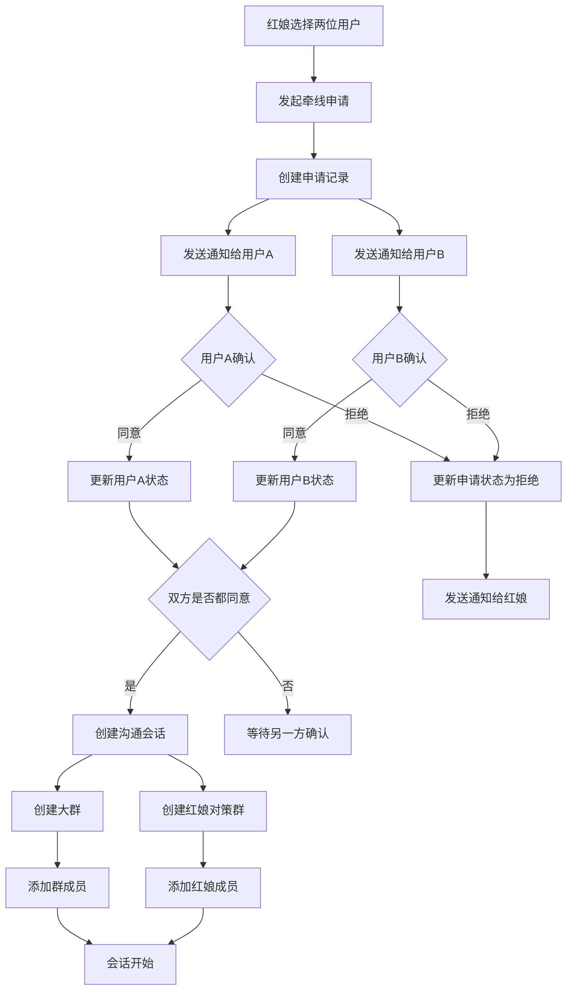
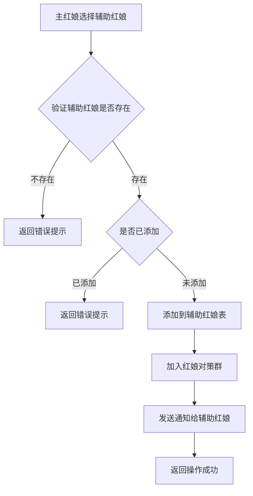
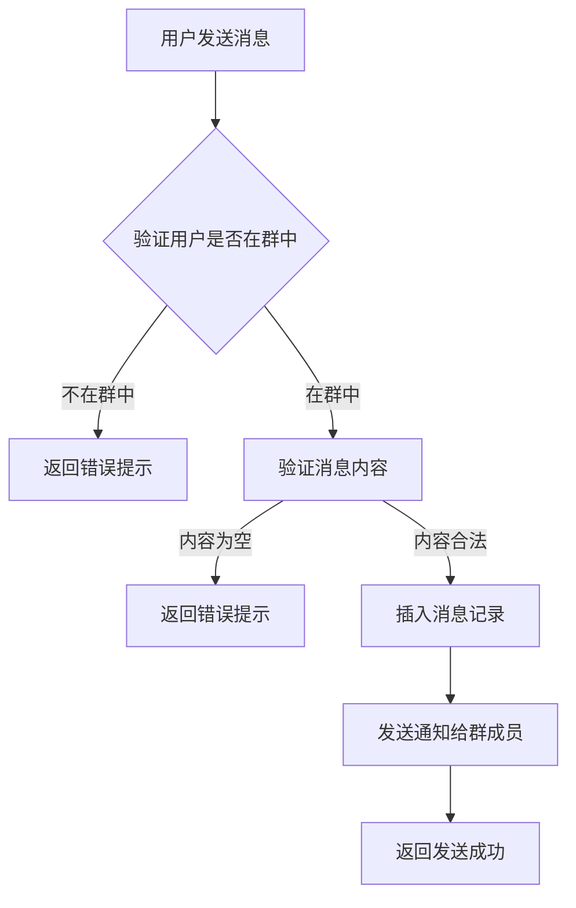
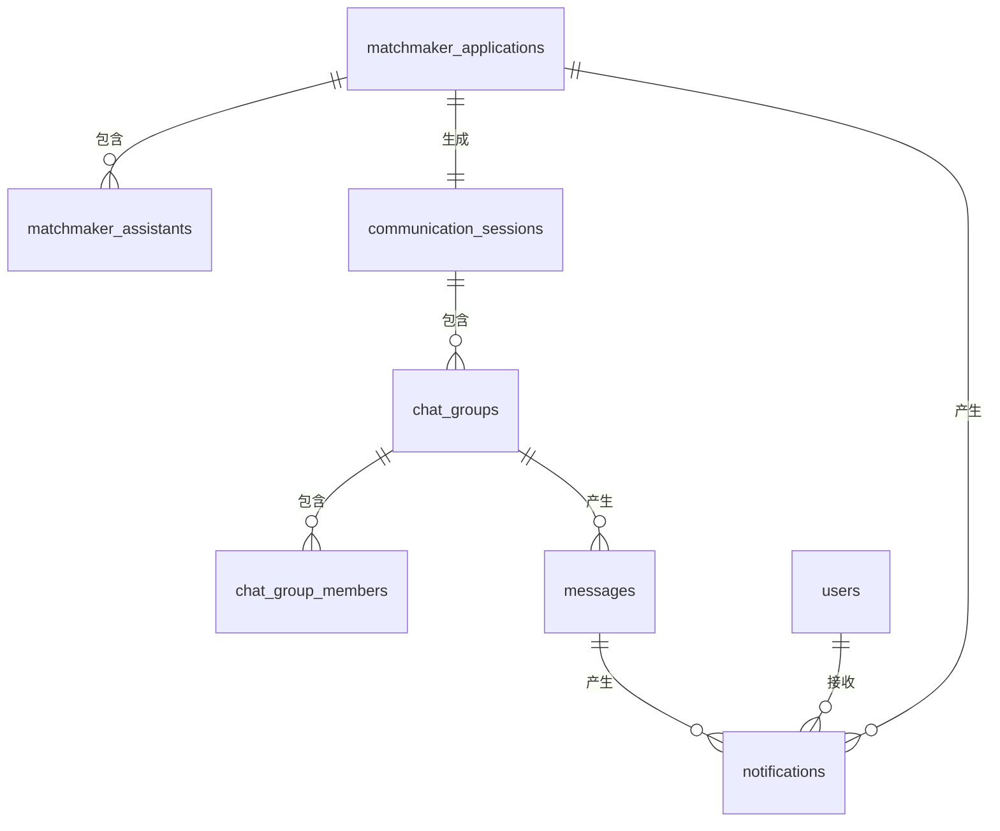

# 沟通管理

## 业务概述

本系统为婚恋社交平台的沟通管理模块，负责红娘牵线、用户沟通、群组聊天等核心业务功能。核心流程为：红娘发起牵线申请 → 用户确认同意 → 建立沟通会话 → 创建群组 → 开始沟通交流。

## 角色定义

### 普通用户
- 接受红娘牵线，与其他普通用户建立沟通关系
- 可以接受或拒绝牵线申请
- 参与群组沟通

### 红娘用户
- 发起牵线申请，为普通用户配对
- 需要竞争上岗，获得双方用户同意后正式担任牵线红娘
- 可以选择辅助红娘协助工作
- 参与群组沟通和策略讨论

## 功能模块

1. **牵线申请**：红娘选择用户发起牵线申请
2. **申请确认**：用户确认接受或拒绝牵线
3. **沟通会话管理**：创建、管理沟通会话
4. **群组管理**：创建大群和红娘对策群
5. **消息管理**：发送、接收消息
6. **通知管理**：发送牵线邀请、状态变更等通知

## 数据表设计

### 1. 红娘牵线申请表 (matchmaker_applications)

| 字段名 | 类型 | 约束 | 说明 |
| :--- | :--- | :--- | :--- |
| `id` | BIGINT | PRIMARY KEY, AUTO_INCREMENT | 申请唯一标识 |
| `matchmaker_id` | BIGINT | NOT NULL, FOREIGN KEY | 申请红娘ID |
| `user_a_id` | BIGINT | NOT NULL, FOREIGN KEY | 用户A ID |
| `user_b_id` | BIGINT | NOT NULL, FOREIGN KEY | 用户B ID |
| `user_a_status` | TINYINT | NOT NULL, DEFAULT 0 | 用户A确认状态：0-待确认，1-同意，2-拒绝 |
| `user_b_status` | TINYINT | NOT NULL, DEFAULT 0 | 用户B确认状态：0-待确认，1-同意，2-拒绝 |
| `application_status` | TINYINT | NOT NULL, DEFAULT 0 | 申请状态：0-待确认，1-已同意，2-已拒绝，3-已过期 |
| `apply_time` | DATETIME | NOT NULL, DEFAULT CURRENT_TIMESTAMP | 申请时间 |
| `user_a_confirm_time` | DATETIME | NULL | 用户A确认时间 |
| `user_b_confirm_time` | DATETIME | NULL | 用户B确认时间 |
| `expire_time` | DATETIME | NULL | 过期时间 |
| `created_at` | DATETIME | NOT NULL, DEFAULT CURRENT_TIMESTAMP | 创建时间 |
| `updated_at` | DATETIME | NOT NULL, DEFAULT CURRENT_TIMESTAMP ON UPDATE CURRENT_TIMESTAMP | 更新时间 |

**索引设计**：
- `idx_matchmaker_id`：matchmaker_id 普通索引
- `idx_user_a_id`：user_a_id 普通索引
- `idx_user_b_id`：user_b_id 普通索引
- `idx_application_status`：application_status 普通索引

### 2. 辅助红娘关联表 (matchmaker_assistants)

| 字段名 | 类型 | 约束 | 说明 |
| :--- | :--- | :--- | :--- |
| `id` | BIGINT | PRIMARY KEY, AUTO_INCREMENT | 关联记录唯一标识 |
| `application_id` | BIGINT | NOT NULL, FOREIGN KEY | 牵线申请ID |
| `assistant_id` | BIGINT | NOT NULL, FOREIGN KEY | 辅助红娘ID |
| `created_at` | DATETIME | NOT NULL, DEFAULT CURRENT_TIMESTAMP | 创建时间 |

**索引设计**：
- `idx_application_id`：application_id 普通索引
- `idx_assistant_id`：assistant_id 普通索引
- `idx_application_assistant_unique`：(application_id, assistant_id) 唯一索引

### 3. 沟通会话表 (communication_sessions)

| 字段名 | 类型 | 约束 | 说明 |
| :--- | :--- | :--- | :--- |
| `id` | BIGINT | PRIMARY KEY, AUTO_INCREMENT | 会话唯一标识 |
| `application_id` | BIGINT | NOT NULL, UNIQUE, FOREIGN KEY | 关联牵线申请ID |
| `user_a_id` | BIGINT | NOT NULL, FOREIGN KEY | 用户A ID |
| `user_b_id` | BIGINT | NOT NULL, FOREIGN KEY | 用户B ID |
| `main_matchmaker_id` | BIGINT | NOT NULL, FOREIGN KEY | 主红娘ID |
| `session_status` | TINYINT | NOT NULL, DEFAULT 1 | 会话状态：0-已结束，1-进行中 |
| `start_time` | DATETIME | NOT NULL, DEFAULT CURRENT_TIMESTAMP | 会话开始时间 |
| `end_time` | DATETIME | NULL | 会话结束时间 |
| `created_at` | DATETIME | NOT NULL, DEFAULT CURRENT_TIMESTAMP | 创建时间 |
| `updated_at` | DATETIME | NOT NULL, DEFAULT CURRENT_TIMESTAMP ON UPDATE CURRENT_TIMESTAMP | 更新时间 |

**索引设计**：
- `idx_application_id`：application_id 唯一索引
- `idx_user_a_id`：user_a_id 普通索引
- `idx_user_b_id`：user_b_id 普通索引
- `idx_main_matchmaker_id`：main_matchmaker_id 普通索引
- `idx_session_status`：session_status 普通索引

### 4. 群组表 (chat_groups)

| 字段名 | 类型 | 约束 | 说明 |
| :--- | :--- | :--- | :--- |
| `id` | BIGINT | PRIMARY KEY, AUTO_INCREMENT | 群组唯一标识 |
| `session_id` | BIGINT | NOT NULL, FOREIGN KEY | 关联沟通会话ID |
| `group_name` | VARCHAR(100) | NOT NULL | 群组名称 |
| `group_type` | TINYINT | NOT NULL | 群组类型：0-大群（红娘+双方用户），1-红娘对策群（主红娘+辅助红娘） |
| `group_status` | TINYINT | NOT NULL, DEFAULT 1 | 群组状态：0-已解散，1-正常 |
| `created_at` | DATETIME | NOT NULL, DEFAULT CURRENT_TIMESTAMP | 创建时间 |
| `updated_at` | DATETIME | NOT NULL, DEFAULT CURRENT_TIMESTAMP ON UPDATE CURRENT_TIMESTAMP | 更新时间 |

**索引设计**：
- `idx_session_id`：session_id 普通索引
- `idx_group_type`：group_type 普通索引
- `idx_group_status`：group_status 普通索引

### 5. 群成员表 (chat_group_members)

| 字段名 | 类型 | 约束 | 说明 |
| :--- | :--- | :--- | :--- |
| `id` | BIGINT | PRIMARY KEY, AUTO_INCREMENT | 成员记录唯一标识 |
| `group_id` | BIGINT | NOT NULL, FOREIGN KEY | 群组ID |
| `user_id` | BIGINT | NOT NULL, FOREIGN KEY | 用户ID |
| `member_role` | TINYINT | NOT NULL, DEFAULT 0 | 成员角色：0-普通成员，1-群主，2-管理员 |
| `join_time` | DATETIME | NOT NULL, DEFAULT CURRENT_TIMESTAMP | 加入时间 |
| `leave_time` | DATETIME | NULL | 离开时间 |
| `is_active` | TINYINT | NOT NULL, DEFAULT 1 | 是否活跃：0-已离开，1-活跃 |
| `created_at` | DATETIME | NOT NULL, DEFAULT CURRENT_TIMESTAMP | 创建时间 |

**索引设计**：
- `idx_group_id`：group_id 普通索引
- `idx_user_id`：user_id 普通索引
- `idx_group_user_unique`：(group_id, user_id) 唯一索引

### 6. 消息记录表 (messages)

| 字段名 | 类型 | 约束 | 说明 |
| :--- | :--- | :--- | :--- |
| `id` | BIGINT | PRIMARY KEY, AUTO_INCREMENT | 消息唯一标识 |
| `group_id` | BIGINT | NOT NULL, FOREIGN KEY | 发送群组ID |
| `sender_id` | BIGINT | NOT NULL, FOREIGN KEY | 发送者ID |
| `message_type` | TINYINT | NOT NULL, DEFAULT 0 | 消息类型：0-文本，1-图片，2-语音，3-视频，4-文件 |
| `content` | TEXT | NULL | 消息内容 |
| `file_url` | VARCHAR(255) | NULL | 文件/图片URL（消息类型为1/3/4时使用） |
| `duration` | INT | NULL | 语音/视频时长（秒） |
| `is_read` | TINYINT | NOT NULL, DEFAULT 0 | 是否已读：0-未读，1-已读 |
| `send_time` | DATETIME | NOT NULL, DEFAULT CURRENT_TIMESTAMP | 发送时间 |
| `created_at` | DATETIME | NOT NULL, DEFAULT CURRENT_TIMESTAMP | 创建时间 |

**索引设计**：
- `idx_group_id`：group_id 普通索引
- `idx_sender_id`：sender_id 普通索引
- `idx_send_time`：send_time 普通索引
- `idx_is_read`：is_read 普通索引

### 7. 通知表 (notifications)

| 字段名 | 类型 | 约束 | 说明 |
| :--- | :--- | :--- | :--- |
| `id` | BIGINT | PRIMARY KEY, AUTO_INCREMENT | 通知唯一标识 |
| `sender_id` | BIGINT | NOT NULL, FOREIGN KEY | 发件人ID |
| `user_id` | BIGINT | NOT NULL, FOREIGN KEY | 收件人ID |
| `notification_type` | TINYINT | NOT NULL | 通知类型：0-牵线邀请，1-牵线同意，2-牵线拒绝，3-消息提醒，4-系统通知 |
| `related_id` | BIGINT | NULL | 关联业务ID（如申请ID、消息ID） |
| `content` | VARCHAR(500) | NOT NULL | 通知内容 |
| `is_read` | TINYINT | NOT NULL, DEFAULT 0 | 是否已读：0-未读，1-已读 |
| `read_time` | DATETIME | NULL | 阅读时间 |
| `created_at` | DATETIME | NOT NULL, DEFAULT CURRENT_TIMESTAMP | 创建时间 |

**索引设计**：
- `idx_sender_id`：sender_id 普通索引
- `idx_user_id`：user_id 普通索引
- `idx_notification_type`：notification_type 普通索引
- `idx_is_read`：is_read 普通索引

**通知内容规则**：
- 红娘发起邀请时，向被邀请双方各发送 1 条通知（共 2 条），通知内容统一为：
  - `{红娘姓名}邀请您参加匹配，[点击进入匹配列表]`
- 通知记录的 `sender_id` 为红娘ID，`user_id` 为被邀请用户ID
- 红娘发件箱通过 `sender_id` 过滤展示（显示 2 条），被邀请用户收件箱通过 `user_id` 过滤展示（各显示 1 条）
- 不再额外为发件箱创建冗余记录

## 业务流程

### 1. 牵线申请流程


```mermaid
graph TD
    A[红娘选择两位用户] --> B[发起牵线申请]
    B --> C[创建申请记录]
    C --> D[发送通知给用户A]
    C --> E[发送通知给用户B]
    D --> F{用户A确认}
    E --> G{用户B确认}
    F -->|同意| H[更新用户A状态]
    F -->|拒绝| I[更新申请状态为拒绝]
    G -->|同意| J[更新用户B状态]
    G -->|拒绝| I
    H --> K{双方是否都同意}
    J --> K
    K -->|是| L[创建沟通会话]
    K -->|否| M[等待另一方确认]
    L --> N[创建大群]
    L --> O[创建红娘对策群]
    N --> P[添加群成员]
    O --> Q[添加红娘成员]
    P --> R[会话开始]
    Q --> R
    I --> S[发送通知给红娘]
```

### 2. 添加辅助红娘流程


```mermaid
graph TD
    A[主红娘选择辅助红娘] --> B{验证辅助红娘是否存在}
    B -->|不存在| C[返回错误提示]
    B -->|存在| D{是否已添加}
    D -->|已添加| E[返回错误提示]
    D -->|未添加| F[添加到辅助红娘表]
    F --> G[加入红娘对策群]
    G --> H[发送通知给辅助红娘]
    H --> I[返回操作成功]
```

### 3. 消息发送流程


```mermaid
graph TD
    A[用户发送消息] --> B{验证用户是否在群中}
    B -->|不在群中| C[返回错误提示]
    B -->|在群中| D[验证消息内容]
    D -->|内容为空| E[返回错误提示]
    D -->|内容合法| F[插入消息记录]
    F --> G[发送通知给群成员]
    G --> H[返回发送成功]
```

## 数据关系图


```mermaid
erDiagram
    matchmaker_applications ||--o{ matchmaker_assistants : "包含"
    matchmaker_applications ||--|| communication_sessions : "生成"
    communication_sessions ||--o{ chat_groups : "包含"
    chat_groups ||--o{ chat_group_members : "包含"
    chat_groups ||--o{ messages : "产生"
    users ||--o{ notifications : "接收"
    matchmaker_applications ||--o{ notifications : "产生"
    messages ||--o{ notifications : "产生"
```

## 注意事项

1. **并发控制**：牵线申请的双方确认状态需考虑并发问题，避免同时操作导致状态不一致
2. **数据一致性**：牵线申请状态变更时，需同步更新沟通会话状态
3. **消息顺序**：消息表需按发送时间排序，确保消息顺序正确
4. **通知及时性**：关键业务操作（如牵线确认、消息发送）需及时发送通知
5. **权限控制**：用户只能查看和发送所属群组的消息
6. **数据归档**：已结束的会话和历史消息可考虑归档处理，优化查询性能

---

## 前端交互设计（仅前端实现）

> 当前阶段仅做前端功能，后端逻辑（数据库/通信等）后续再接入。

### 1. 牵线匹配面板（已完成）

**触发条件**：红娘角色在广场页面连线两个用户后

**界面位置**：广场页面右侧固定区域（不随节点移动）

**界面内容**：
- 标题：牵线匹配
- 两个用户信息卡片（头像 + 姓名）
- 中间连接符号
- 操作按钮：
  - 发送匹配请求（主按钮）
  - 取消匹配（次要按钮，红色）
- 关闭按钮（右上角）

**交互逻辑**：
- 点击"发送匹配请求"：发送通知给两个被邀请用户（当前阶段模拟发送给自己）
- 点击"取消匹配"：删除连线并隐藏面板
- 点击关闭按钮：隐藏面板但保留连线

---

### 2. 通知中心（收件箱 + 发件箱）

**界面位置**：HeaderBar 右上角，通知图标带 Badge 角标

**界面结构**：通知中心面板顶部有两个 Tab：「收件箱」和「发件箱」

**收件箱**：当前用户收到的通知
**发件箱**：当前用户发出的通知

**通知内容规则**：
- 红娘发起邀请时，向被邀请双方各发送 1 条通知（共 2 条），通知内容统一为：
  - `{红娘姓名}邀请您参加匹配，[点击进入匹配列表]`
- 通知记录的 `sender_id` 为红娘ID，`user_id` 为被邀请用户ID
- 红娘发件箱通过 `sender_id` 过滤展示（显示 2 条），被邀请用户收件箱通过 `user_id` 过滤展示（各显示 1 条）
- 不再额外为发件箱创建冗余记录

**通知要素**：发件人、收件人、内容、创建时间（前端根据发件箱/收件箱显示为"发送时间"/"接收时间"）

**交互流程**：
1. 点击铃铛图标，弹出通知中心面板，默认显示收件箱
2. 切换 Tab 查看收件箱/发件箱
3. 列表每行显示：标题、内容摘要、时间
4. 点击某条通知，弹出详情小框：
   - 标题
   - 发件人/收件人（根据当前Tab显示）
   - 时间
   - 详细内容（含可点击的"点击进入匹配列表"链接）
   - 按钮：确定（关闭弹窗）

**通知自动拉取与轮询**：
- 页面加载时自动拉取当前用户的收件箱通知
- 设置定时器每 1 分钟轮询一次新通知
- 未读通知数量通过 Badge 角标实时显示（仅收件箱未读计数，发件箱新消息不显示红点）

**状态变更**：
- 用户在邀请管理中接受邀请：
  - 红娘收到通知："某某用户已接收匹配邀请"
  - 红娘通知铃铛 Badge +1
- 用户在邀请管理中拒绝邀请：
  - 红娘收到通知："某某用户拒绝匹配邀请"
  - 红娘通知铃铛 Badge +1

---

### 3. 邀请管理菜单（待开发）

**界面位置**：HeaderBar 右上角用户下拉菜单中，"我的"选项下方

**可见性**：所有角色（红娘 + 普通用户）都能看到

**界面内容**：
点击"邀请管理"菜单项，弹出列表面板，展示当前用户相关的所有牵线邀请：

**列表项结构**：
```
邀请日期 | 红娘姓名
用户A头像 用户A姓名 [用户A确认状态] - [连线] - [用户B确认状态] 用户B头像 用户B姓名
[接受邀请]  [拒绝邀请]
```

**状态显示规则**：
- 每个用户的确认状态显示在各自头像下方（不在连线中间）
- 初始状态：用户A、用户B头像和名字均为灰色，头像下方显示"待确认"
- 用户A确认后：用户A头像和名字恢复彩色/黑色，头像下方显示"已接受"
- 用户B确认后：用户B头像和名字恢复彩色/黑色，头像下方显示"已接受"
- 双方都确认后：头像下方的状态标签隐藏，连线上方显示"双方已接受"
- **拒绝流程特殊规则**：
  - 当一方（如A）点击拒绝时，另一方（B）**看不到**A的拒绝状态，B仍然看到A显示"待确认"，B仍可正常操作（接受或拒绝）
  - 红娘（管理员）**始终可以看到**双方的真实状态（包括已拒绝）
  - 只有当**双方都完成操作**后，才能看到对方的状态
  - 双方都操作后的两种可能状态：
    - "双方意见不一"：一方接受、一方拒绝 → 连线变红色，连线上方显示"双方意见不一"
    - "双方已拒绝"：双方都拒绝 → 连线变红色，连线上方显示"双方已拒绝"
- 连线颜色：双方都确认后变绿色；任一方拒绝或双方意见不一时变红色；否则灰色
- **底部状态标签：完全移除，不再显示**

**交互功能**：
- 点击任意用户头像，弹出用户信息小框（所有角色均可查看匹配对象的信息）
- 红娘在该页面中无任何操作按钮，仅查看
- 被邀请用户可以在列表中点击"接受"或"拒绝"按钮：
  - 点击"接受"：更新状态，发送通知给红娘
  - 点击"拒绝"：更新状态，发送通知给红娘
  - 已接受/已拒绝的邀请，按钮变为禁用状态

**可见范围**：
- 红娘：只能看到自己发起的邀请
- 普通用户：只能看到自己被邀请的匹配

**红娘名称显示**：
- 红娘名称必须从 expand 数据中正确获取，显示为实际的红娘姓名/用户名/邮箱
- 禁止显示为"红娘：红娘"这种 fallback 值

---

### 4. 用户信息弹窗（待开发）

**触发条件**：在邀请管理列表中点击用户头像

**界面内容**：
- 用户头像（大图）
- 用户姓名
- 性别、年龄
- 个人简介
- 标签（如有）
- 关闭按钮

> 与广场页面双击头像节点展示的信息一致，仅展示样式不同，内容相同。

**可见性**：红娘和普通用户都可以点击查看被邀请人的信息

---

### 5. 前端数据流（模拟）

由于当前仅做前端，使用内存数据模拟：

```typescript
// 牵线申请数据（内存存储）
interface MatchApplication {
  id: string
  matchmakerId: string      // 红娘ID
  matchmakerName: string    // 红娘姓名
  userA: {
    id: string
    name: string
    avatar: string
    status: 'pending' | 'accepted' | 'rejected'  // 待确认/已接受/已拒绝
    confirmTime?: Date
  }
  userB: {
    id: string
    name: string
    avatar: string
    status: 'pending' | 'accepted' | 'rejected'
    confirmTime?: Date
  }
  applicationStatus: 'pending' | 'confirmed' | 'rejected'
  applyTime: Date
}

// 通知数据（内存存储）
interface Notification {
  id: string
  senderId: string          // 发件人ID
  senderName: string        // 发件人姓名
  userId: string            // 收件人ID
  type: 'matchmaking_invite' | 'matchmaking_accepted' | 'matchmaking_rejected'
  title: string
  content: string
  relatedApplicationId: string  // 关联的牵线申请ID
  isRead: boolean
  createdAt: Date
}
```

**数据存储位置**：
- 使用 Pinia store 管理（新建 `stores/matchmaking.ts`）
- 页面刷新后数据清空（模拟数据，无需持久化）

---

### 6. 开发顺序

1. **数据状态管理**
   - 创建 matchmaking store
   - 定义牵线申请和通知的数据结构
   - 实现通知发送和接收的模拟逻辑

2. **通知铃铛系统**
   - 通知列表面板组件
   - 通知详情弹窗组件
   - 通知内容中的"点击进入列表"链接跳转功能

3. **邀请管理菜单**
   - 下拉菜单中添加"邀请管理"选项
   - 邀请列表面板组件
   - 状态显示逻辑（灰色/绿色/红色）
   - 接受/拒绝按钮交互，发送通知给红娘

4. **用户信息弹窗**
   - 复用现有的 UserDrawer 或新建小组件
   - 在邀请列表中集成点击头像功能

---

### 7. 测试场景

**场景1：红娘发起牵线**
1. 红娘登录，在广场连线两个用户
2. 右侧弹出匹配面板，显示两个用户信息
3. 点击"发送匹配请求"
4. 面板关闭，连线保留

**场景2：用户收到通知**
1. 被邀请用户（当前模拟为自己）登录
2. 页面加载后自动拉取通知，铃铛图标显示 Badge（数字为未读通知数）
3. 点击铃铛，弹出通知列表（收件箱 + 发件箱两个 Tab）
4. 收件箱显示 1 条通知，发件箱显示 2 条通知（红娘发送的 2 条）
5. 点击第一条通知，弹出详情
6. 点击"确定"关闭弹窗
7. 点击通知内容中的"点击进入列表"链接，跳转到邀请管理页面

**场景3：邀请管理**
1. 任意角色登录
2. 点击右上角头像下拉菜单
3. 点击"邀请管理"
4. 弹出邀请列表，显示状态
   - 红娘角色：邀请列表中显示双方用户头像和各自确认状态，红娘名称正确显示
   - 普通用户：邀请列表中显示双方用户头像和各自确认状态
5. 点击任意用户头像，查看该用户信息
6. 被邀请用户点击"接受"按钮，红娘收到"某某已接受"通知
7. 被邀请用户点击"拒绝"按钮，红娘收到"某某已拒绝"通知

**场景4：匹配成功**
1. 两个用户都接受邀请
2. 邀请列表中双方头像下方状态标签隐藏，连线上方显示"双方已接受"，连线变绿色
3. 红娘收到两条"已接受"通知

**场景5：双方意见不一**
1. 用户A拒绝邀请，用户B接受邀请（顺序不限）
2. A点击拒绝后，B仍然看到A显示"待确认"，B仍可正常操作
3. B点击接受后，双方都完成操作
4. 连线上方显示"双方意见不一"，连线变红色
5. 红娘收到"某某已拒绝"和"某某已接受"通知

**场景6：双方已拒绝**
1. 两个用户都拒绝邀请
2. 连线上方显示"双方已拒绝"，连线变红色
3. 红娘收到两条"已拒绝"通知

---

### 8. 消息中心（聊天系统）

> 替代原"通知中心"的铃铛图标入口，重构为类似微信的聊天列表 + 聊天窗口界面。
> 原通知中心功能保留，作为消息中心顶部应用栏的一个入口。

#### 8.1 消息中心入口

**界面位置**：HeaderBar 右上角，铃铛图标（原通知中心图标）

**行为变更**：
- 点击铃铛图标 → 弹出**消息中心面板**（聊天列表），不再是原来的通知中心
- 未读消息数量通过 Badge 角标显示（聊天未读数 + 通知未读数）

#### 8.2 消息中心面板（聊天列表）

**界面布局**（类似微信）：

```
┌─────────────────────────────────┐
│  消息中心          [通知中心图标] │  ← 顶部应用栏
├─────────────────────────────────┤
│  🔍 搜索框                       │  ← 搜索栏（可选，后续实现）
├─────────────────────────────────
│  ┌───────────────────────────┐  │
│  │ [群头像]  群名称            │  │
│  │           最后一条消息摘要  │  │
│  │                  时间      │  │
│  │                  [未读数]  │  │
│  ├───────────────────────────┤  │
│  │ [群头像]  群名称            │  │
│  │           ...              │  │
│  └───────────────────────────┘  │
─────────────────────────────────┘
```

**顶部应用栏**：
- 左侧标题："消息中心"
- 右侧：通知中心图标（铃铛），点击后弹出原有的通知中心面板（收件箱 + 发件箱）

**聊天列表项**：
- 群头像（取群内第一个成员的头像，或群名称首字）
- 群名称
- 最后一条消息摘要（截断显示）
- 最后消息时间（相对时间，如"刚刚"、"5分钟前"）
- 未读消息数 Badge（仅当有未读消息时显示）

**交互**：
- 点击某个聊天项 → 进入对应的聊天窗口
- 点击顶部通知中心图标 → 弹出原通知中心面板（覆盖在聊天列表之上）

#### 8.3 聊天窗口

**窗口尺寸**：
- 默认尺寸：800×600（4:3 比例）
- 支持全屏切换
- 右侧信息栏固定宽度 220px
- 左侧聊天区域自适应宽度
- 聊天消息区域和底部输入区域的高度可通过拖拽分隔条自由调节

**界面布局**（左右布局）：

```
┌──────────────────────────────────────────────────────┐
│  群名称                              [最大化] [×]    │  ← 顶部栏（title 属性提示）
────────────────────────┬─────────────────────────────
│                        │  📢 群公告                    │
│                        │  ┌─────────────────────────┐ │
│                        │  │ 公告内容...              │ │
│  聊天消息区域           │  │                          │ │
│  （类似微信样式）       │  ─────────────────────────┘ │
│                        │                             │
│  ┌──────────────────┐  │  👥 群成员 (5)              │
│  │ 对方：你好！      │  │  ┌─────────────────────────┐ │
│  ──────────────────┘  │  │  冯南昌 [群主]          │ │
│  ──────────────────┐  │  │  李助理 [管理员]        │ │
│  │ 我：好的          │  │  │  晓哥   [主角]         │ │
│  └──────────────────┘  │  │  青妹   [主角]         │ │
│                        │  │  王协调 [外部]          │ │
│═══════════════════════│  └─────────────────────────┘ │
│  ┌──────────────────┐  │                             │
│  │ [输入框 3行]      │  │                             │
│  │                   │  │                             │
│  │                   │  │                             │
│  └──────────────────┘  │                             │
│  😊              [发送] │  ← 第二行：表情(左) 发送(右) │
└────────────────────────┴─────────────────────────────┘
```

**顶部栏**：
- 居中显示群名称
- 右侧两个按钮：最大化/还原按钮、关闭按钮（×）
- 按钮使用原生 `title` 属性提示（hover 显示"最大化"/"还原"/"关闭"），不使用 Tooltip 组件
- 关闭按钮 hover 时背景变红色（Windows 风格）

**左侧聊天区域**（自适应宽度）：

- 消息气泡样式参考微信：
  - 对方消息：白色气泡，靠左，左侧显示头像
  - 自己消息：绿色气泡（#95EC69），靠右，右侧显示头像
  - 系统消息：居中灰色小字（如"冯南昌邀请了李助理加入群聊"）
- 每条消息显示：头像 + 气泡（含发送者姓名 + 消息内容 + 时间）
- 自动滚动到底部（新消息到来时）
- 文字 14px，emoji 表情 18px

**拖拽分隔条**：
- 聊天消息区域和输入区域之间有 4px 高的分隔条（始终 4px，hover 时颜色加深）
- 鼠标拖拽可自由调节输入框高度，工具栏固定在底部
- 最小高度限制：消息区域 100px，输入区域 80px（至少保留一行输入）

**底部输入区域**（两行布局）：

第一行 — 输入框：
- 3 行高度的 textarea，可自动扩展
- 白色背景，圆角边框
- 聚焦时边框变绿色

第二行 — 工具栏：
- 左侧：表情图标按钮（SVG 笑脸图标，22×22px），点击弹出表情选择器
- 右侧：绿色"发送"按钮
- 表情图标和发送按钮在同一行，分居左右两端

**表情选择器**：
- 点击表情图标后，在输入区域上方弹出表情面板
- 10 列网格布局，包含常用黄脸表情
- 表情尺寸 22px
- 点击表情自动插入输入框并关闭面板

**右侧信息区域**（固定宽度 220px，分上下两部分）：

**上半部分 - 群公告**：
- 标题：" 群公告"
- 显示公告内容（纯文本）
- 仅群主（红娘）可编辑公告，显示"编辑"按钮
- 其他成员只读

**下半部分 - 群成员列表**：
- 标题："👥 群成员 (N)"
- 成员按角色分组排序：主导角色 → 主角 → 外部人员
- 每个成员显示：头像 + 姓名 + 角色标签

#### 8.4 成员角色与图标

**权限角色**（复用 `chat_group_members.member_role`）：

| 角色值 | 角色名 | 默认分配 | 图标 | 颜色 |
|--------|--------|---------|------|------|
| `1` | 群主 | 发起牵线的红娘 |  皇冠 | 金色 |
| `2` | 管理员 | 辅助红娘、助理等主导角色（红娘除外） |  工具 | 粉色 |
| `0` | 普通成员 | 匹配双方（主角）+ 外部协调人员 |  人物 | 灰色 |

**主角与外部人员的区分**：
- 通过 `chat_group_members.user_id` 关联 `communication_sessions` 的 `user_a_id` / `user_b_id` 判断
- 匹配双方（`user_a_id` / `user_b_id`）→ 显示"主角"标签， 图标，蓝色
- 其他普通成员 → 显示"外部"标签， 图标，灰色

**成员列表排序**：群主 → 管理员 → 主角 → 外部人员

**群主标识**：
- 群主在成员列表中额外显示"[群主]"标签
- 默认群主为发起牵线的红娘（`main_matchmaker_id`）

#### 8.5 权限控制

| 功能 | 群主（红娘） | 管理员（辅助红娘/助理） | 普通成员（主角/外部） |
|------|------------|----------------------|---------------------|
| 发送消息 | ✅ | ✅ | ✅ |
| 编辑群公告 | ✅ | ❌（只读） | ❌（只读） |
| 拉人入群 | ✅ | ❌ | ❌ |
| 踢人出群 | ✅ | ❌ |  |
| 查看成员列表 | ✅ | ✅ | ✅ |

**群主专属按钮**（仅群主可见）：
- 群公告区域的"编辑"按钮
- 成员列表底部的"邀请成员"按钮

#### 8.6 数据存储

**使用 SQLite（PocketBase）存储聊天记录**：

- 消息表：`messages`（已在 schema.sql 中定义）
- 存储方式：**一条记录存储一条消息**，通过 `group_id` 关联会话
- 理由：
  - 可查询、可分页、支持索引
  - PocketBase 原生支持
  - 2 核 2G 40G 服务器完全够用
  - schema.sql 中已定义好表结构

**消息记录字段**（对应 messages 表）：
- `group_id`：所属群组ID
- `sender_id`：发送者ID
- `message_type`：消息类型（0-文本，1-图片，2-语音，3-视频，4-文件）
- `content`：消息内容（文本消息时使用）
- `file_url`：文件/图片URL
- `duration`：语音/视频时长
- `is_read`：是否已读
- `send_time`：发送时间

#### 8.7 沟通会话与群组自动创建

**触发条件**：邀请管理中双方都接受邀请后（`application_status = 1`）

**自动创建流程**：
1. 创建 `communication_sessions` 记录
2. 创建大群（`chat_groups`，`group_type=0`，群名格式：`{userA姓名}与{userB姓名}的沟通群`）
3. 创建红娘对策群（`chat_groups`，`group_type=1`，群名格式：`{红娘姓名}的对策群`）
4. 添加群成员（`chat_group_members`）：
   - 大群：红娘（群主）+ 用户A + 用户B
   - 对策群：红娘（群主）+ 辅助红娘（如有）
5. 发送通知给相关用户："您已被邀请加入沟通群"

#### 8.8 测试数据

为展示界面效果，预置以下测试数据（仅前端模拟，不写入数据库）：

**测试群组1：晓哥与青妹的沟通群**
- 群主：冯南昌（红娘，群主）
- 成员：晓哥（主角，普通成员）、青妹（主角，普通成员）、李助理（助理，管理员）
- 公告："欢迎两位！请友好交流，红娘会全程协助。"
- 消息记录：
  - 冯南昌："欢迎晓哥和青妹加入！"（系统消息样式）
  - 晓哥："你好青妹，很高兴认识你 😊"
  - 青妹："你好晓哥，我也很高兴！"
  - 冯南昌："两位可以先聊聊兴趣爱好～"
  - 晓哥："我平时喜欢爬山和摄影"
  - 青妹："我也喜欢摄影！你用什么相机？"

**测试群组2：张三与李四的沟通群**
- 群主：冯南昌（红娘，群主）
- 成员：张三（主角，普通成员）、李四（主角，普通成员）、王协调（外部人员，普通成员）
- 公告：无
- 消息记录：
  - 冯南昌："欢迎两位！"
  - 张三："你好！"
  - 李四："你好张三！"

#### 8.9 开发顺序

1. **消息中心面板（聊天列表）**
   - 重构 HeaderBar 铃铛图标行为
   - 新建聊天列表面板组件
   - 顶部应用栏集成通知中心入口

2. **聊天窗口**
   - 左右布局框架
   - 左侧聊天消息区域（微信样式气泡）
   - 右侧信息区域（公告 + 成员列表）

3. **权限与角色**
   - 成员角色标签与图标
   - 群主专属按钮（编辑公告、邀请成员）

4. **后端对接**
   - 双方接受后自动创建会话和群组
   - 消息发送/接收/轮询
   - 公告编辑功能

#### 8.10 测试场景

**场景7：消息中心入口**
1. 任意用户登录
2. 点击右上角铃铛图标
3. 弹出消息中心面板（聊天列表），不再是原来的通知中心
4. 顶部应用栏右侧有通知中心图标
5. 点击通知中心图标，弹出原通知中心面板

**场景8：聊天列表**
1. 消息中心面板显示聊天列表
2. 每个聊天项显示：群头像、群名称、最后消息摘要、时间、未读数
3. 点击某个聊天项，进入聊天窗口

**场景9：聊天窗口**
1. 左侧显示聊天消息（微信样式气泡）
2. 右侧上半部分显示群公告
3. 右侧下半部分显示群成员列表
4. 成员按权限角色排序：群主 → 管理员 → 普通成员
5. 普通成员中，主角显示 图标+蓝色"主角"标签，外部人员显示 图标+灰色"外部"标签
6. 每个成员显示头像、姓名、角色标签

**场景10：群主权限**
1. 红娘登录，进入自己创建的群
2. 群公告区域显示"编辑"按钮
3. 成员列表底部显示"邀请成员"按钮
4. 普通用户进入同一群，看不到这些按钮

**场景11：发送消息**
1. 在聊天窗口底部输入框输入消息
2. 点击"发送"按钮
3. 消息出现在聊天区域（自己消息靠右绿色气泡）
4. 聊天列表中该群的最后消息摘要和时间更新

---

## 后端开发计划

> 前端聊天框架已基本完成，以下进入后端对接阶段。数据库集合（7个表）和牵线申请+通知功能已实现。

### 已完成

| 模块 | 状态 |
|------|------|
| 数据库集合（7个表） | ✅ 已创建 |
| 牵线申请 + 通知（matchmaking store） | ✅ 已实现 |
| 会话与群组自动创建 | ✅ 双方接受后自动创建会话、大群、成员、系统消息 |
| chat store 重构 | ✅ 移除测试数据，对接后端 API |
| 消息收发对接 | ✅ 发送消息、加载消息、标记已读 |
| 群组列表对接 | ✅ 查询我的群组、群组摘要、群组详情 |
| 群公告对接 | ✅ 加载公告、编辑公告（使用 notice 字段） |
| 消息轮询 | ✅ 未打开对话框30秒、打开对话框5秒 |
| 群成员管理前端 UI | ✅ 成员操作菜单（设为管理员/取消管理员/转让群主/删除成员） |
| 系统消息类型 | ✅ message_type=5 表示系统消息，灰色居中显示 |

### 待完成（后端功能）

| 序号 | 功能 | 说明 |
|------|------|------|
| 1 | 群成员管理后端 | 添加成员、删除成员、设置管理员、更换群主的实际数据库操作 |
| 2 | 邀请成员弹窗 | 选择用户并邀请加入群聊的完整流程 |