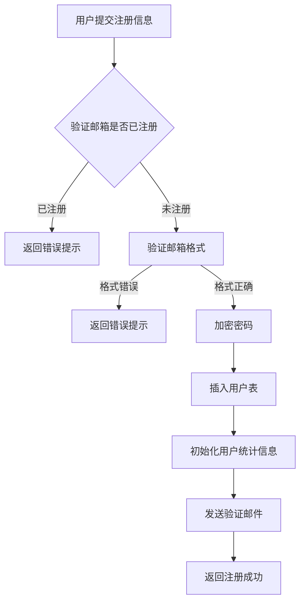
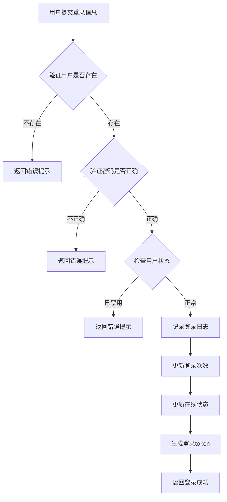
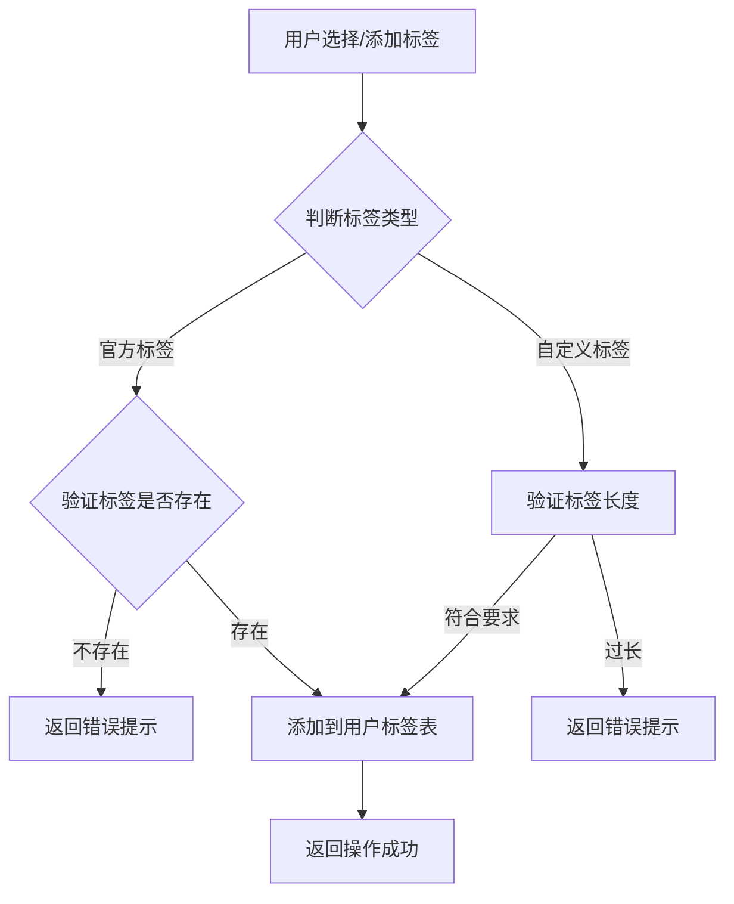
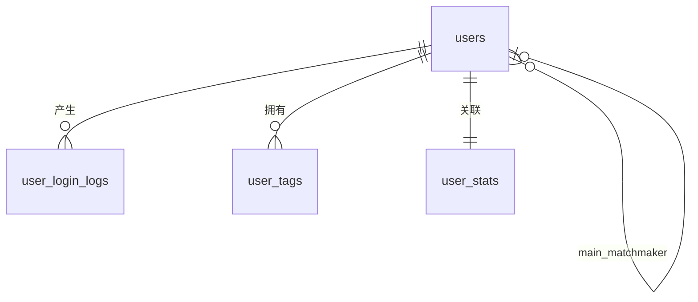

# 用户管理

## 业务概述

本系统为婚恋社交平台，包含两类核心用户角色：普通用户和红娘用户。用户管理模块负责用户账号的注册、登录、信息维护等核心功能。

## 角色定义

### 普通用户
- 平台的主要使用群体
- 可以被红娘牵线，与其他普通用户建立沟通关系
- 可以接受或拒绝牵线申请

### 红娘用户
- 平台的服务提供者角色
- 可以发起牵线申请，为普通用户配对
- 需要竞争上岗，获得双方用户同意后才能正式担任牵线红娘
- 可以选择辅助红娘协助工作

## 功能模块

1. **用户注册**：普通用户/红娘用户注册
2. **用户登录**：账号密码登录，记录登录日志
3. **个人信息维护**：修改个人资料、标签管理
4. **用户状态管理**：在线状态、活跃状态

## 数据表设计

### 1. 用户主表 (users)

| 字段名 | 类型 | 约束 | 说明 |
| :--- | :--- | :--- | :--- |
| `id` | BIGINT | PRIMARY KEY, AUTO_INCREMENT | 用户唯一标识 |
| `username` | VARCHAR(50) | NOT NULL, UNIQUE | 用户名 |
| `email` | VARCHAR(100) | NOT NULL, UNIQUE | 邮箱地址 |
| `password` | VARCHAR(255) | NOT NULL | 加密后的密码 |
| `gender` | TINYINT | NOT NULL, DEFAULT 0 | 性别：0-保密，1-男，2-女 |
| `age` | TINYINT | NULL | 年龄 |
| `bio` | VARCHAR(500) | NULL | 个人简介 |
| `avatar` | VARCHAR(255) | NULL | 头像URL |
| `role` | TINYINT | NOT NULL, DEFAULT 0 | 角色：0-普通用户，1-红娘用户 |
| `is_admin` | TINYINT | NOT NULL, DEFAULT 0 | 是否管理员：0-否，1-是（管理员可访问用户管理页面并管理所有用户，至少保留一个管理员） |
| `status` | TINYINT | NOT NULL, DEFAULT 1 | 用户状态：0-禁用，1-正常 |
| `is_online` | TINYINT | NOT NULL, DEFAULT 0 | 在线状态：0-离线，1-在线 |
| `current_partner_id` | BIGINT | NULL, FOREIGN KEY | 当前交往对象ID（普通用户专属，最多一个） |
| `main_matchmaker_id` | BIGINT | NULL, FOREIGN KEY | 牵线红娘ID（普通用户专属，最多一个） |
| `created_at` | DATETIME | NOT NULL, DEFAULT CURRENT_TIMESTAMP | 注册时间 |
| `updated_at` | DATETIME | NOT NULL, DEFAULT CURRENT_TIMESTAMP ON UPDATE CURRENT_TIMESTAMP | 更新时间 |
| `deleted_at` | DATETIME | NULL | 软删除时间 |

**索引设计**：
- `idx_username`：username 唯一索引
- `idx_email`：email 唯一索引
- `idx_role`：role 普通索引
- `idx_status`：status 普通索引
- `idx_current_partner_id`：current_partner_id 普通索引
- `idx_main_matchmaker_id`：main_matchmaker_id 普通索引

### 2. 用户登录日志表 (user_login_logs)

| 字段名 | 类型 | 约束 | 说明 |
| :--- | :--- | :--- | :--- |
| `id` | BIGINT | PRIMARY KEY, AUTO_INCREMENT | 日志唯一标识 |
| `user_id` | BIGINT | NOT NULL, FOREIGN KEY | 用户ID |
| `login_time` | DATETIME | NOT NULL, DEFAULT CURRENT_TIMESTAMP | 登录时间 |
| `login_ip` | VARCHAR(50) | NULL | 登录IP地址 |
| `device_type` | VARCHAR(50) | NULL | 登录设备类型（如：web, ios, android） |
| `device_info` | VARCHAR(255) | NULL | 设备详细信息 |

**索引设计**：
- `idx_user_id`：user_id 普通索引
- `idx_login_time`：login_time 普通索引

### 3. 用户标签表 (user_tags)

| 字段名 | 类型 | 约束 | 说明 |
| :--- | :--- | :--- | :--- |
| `id` | BIGINT | PRIMARY KEY, AUTO_INCREMENT | 标签记录唯一标识 |
| `user_id` | BIGINT | NOT NULL, FOREIGN KEY | 用户ID |
| `tag_name` | VARCHAR(50) | NOT NULL | 标签名称 |
| `tag_type` | TINYINT | NOT NULL, DEFAULT 0 | 标签类型：0-官方标签，1-自定义标签 |
| `created_at` | DATETIME | NOT NULL, DEFAULT CURRENT_TIMESTAMP | 创建时间 |

**索引设计**：
- `idx_user_id`：user_id 普通索引
- `idx_tag_name`：tag_name 普通索引
- `idx_user_tag_unique`：(user_id, tag_name) 唯一索引

### 4. 用户统计信息表 (user_stats)

| 字段名 | 类型 | 约束 | 说明 |
| :--- | :--- | :--- | :--- |
| `id` | BIGINT | PRIMARY KEY, AUTO_INCREMENT | 统计记录唯一标识 |
| `user_id` | BIGINT | NOT NULL, UNIQUE, FOREIGN KEY | 用户ID |
| `login_count` | INT | NOT NULL, DEFAULT 0 | 累计登录次数 |
| `interaction_count` | INT | NOT NULL, DEFAULT 0 | 互动次数（点赞、评论等） |
| `popularity_score` | INT | NOT NULL, DEFAULT 0 | 人气值 |
| `created_at` | DATETIME | NOT NULL, DEFAULT CURRENT_TIMESTAMP | 创建时间 |
| `updated_at` | DATETIME | NOT NULL, DEFAULT CURRENT_TIMESTAMP ON UPDATE CURRENT_TIMESTAMP | 更新时间 |

**索引设计**：
- `idx_user_id`：user_id 唯一索引

## 业务流程

### 1. 用户注册流程

### 2. 用户登录流程

### 3. 标签管理流程

## 数据关系图

## 注意事项

1. **密码安全**：用户密码必须使用 bcrypt 或其他安全算法加密存储，禁止明文存储
2. **数据完整性**：用户删除采用软删除方式，保留历史数据
3. **性能优化**：高频查询字段（如用户状态、角色）需建立索引
4. **隐私保护**：敏感信息（如密码）禁止对外暴露
5. **并发控制**：登录次数、在线状态等字段更新需考虑并发问题